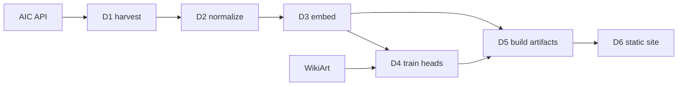

# ArtiFact: Build Tracker

As of 2026-09-22. Living version: https://claude.ai/code/artifact/7102f034-87f7-4100-b6e0-406c2a2b376f

## The project in one page

ArtiFact labels artworks by time period, location and art style, then makes that browsable on a static website. Two systems meet at a file boundary: an offline Python pipeline that produces frozen data artifacts, and a website that reads only those artifacts. The website never imports torch.

The three axes are not equally hard, and that asymmetry drives every choice below.

| Axis | Source | Model needed |
| --- | --- | --- |
| Time period | Museum metadata (`date_start` / `date_end`) | No |
| Location | Museum metadata (`place_of_origin`, free text) | No — needs normalization |
| Art style | Largely missing from museum metadata | **Yes — this is the model's job** |

So the classifier fills the one gap the data cannot. Predicted style x known date x known place is the browsing surface, and the site marks which values are observed and which are inferred.

## Decisions locked in

Two datasets with two different jobs, and a frozen backbone instead of a fine-tuned CNN.

### Corpus: Art Institute of Chicago Open Access

[AIC's public API](https://www.artic.edu/open-access/public-api) serves ~120k artworks, ~50k of them CC0 images, through an IIIF image server with no API key and a 60 req/min anonymous limit. Its metadata already carries the period and location axes. Critically, it is the only strong option whose images are legally safe to display on a public site.

Scope cap: **~9.6k painting-like works** with a public-domain image and a parseable date. Measured 2026-09-22, not estimated — AIC is overwhelmingly a works-on-paper collection, and the painting count is far smaller than first assumed:

| Type | Public domain, with image and date |
| --- | --- |
| Print | 24,613 |
| Drawing and Watercolor | 7,498 |
| **Painting** | **1,864** |
| Miniature Painting | 229 |
| *painting-like total* | *9,591* |
| *all types* | *~59,000* |

Harvested 2026-09-22: 58,787 records, of which 9,591 are painting-like — matching the API's own aggregation exactly.

Decided 2026-09-22: painting-like only. Prints are the tempting 24.6k, but AIC's prints are mostly Japanese ukiyo-e and European etchings — far outside WikiArt's domain, so the style head would be guessing on two thirds of the corpus. A smaller corpus whose labels mean something beats a large one whose labels do not.

| Dataset | Size | Style labels | Date / place | Images hostable |
| --- | --- | --- | --- | --- |
| [AIC Open Access](https://www.artic.edu/open-access/public-api) | ~50k CC0 images | `style_title`, but see below | Yes | **Yes, CC0** |
| [Met Open Access](https://github.com/metmuseum/openaccess) | ~492k objects | No | Yes | Yes, CC0 |
| [WikiArt](https://huggingface.co/datasets/huggan/wikiart) | ~81k | **Yes, 27 styles** | Via artist only | Murky |
| [SemArt](https://github.com/noagarcia/SemArt) | 21k | School / timeframe | Excellent | No, research only |
| [Web Gallery of Art](https://www.wga.hu/database/download/index.html) | ~48k | School / form / type | Excellent | No, redistribution barred |

**AIC's `style_title` is not a style taxonomy.** Only 1,875 of 9,667 painting-like works carry one at all, and the top values are `18th Century` (260), `nineteenth century` (228), `17th Century` (185), `Chinese (culture or style)` (163), `19th century` (127) — centuries and cultures, with the same era spelled three ways. Real movements are a thin tail: Impressionism 158, Post-Impressionism 56, Realism 39. This confirms the premise the whole project rests on — the model has to supply the style axis — and rules out using AIC labels as a held-out evaluation set. Evaluate on a WikiArt split instead, and treat AIC style agreement as an eyeball check only.

### Training labels: WikiArt

Train the style head on WikiArt and never redistribute it, then apply it to the AIC corpus. That is what supplies the style dimension for images you are allowed to show.

### Model: frozen CLIP encoder + small trained heads

Start with `openai/clip-vit-base-patch32` to get the pipeline working end to end; swapping to ViT-L/14 or SigLIP later is a config line and a re-run of D3, because the heads are just linear layers.

Run the expensive step once, cache the vectors, and a head trains in seconds on CPU. That buys four things a fine-tuned CNN gives none of:

- **Cheap iteration** — retrain with a new taxonomy without re-encoding
- **Free extra axes** — a medium or genre head is another linear layer on the same vectors
- **Similarity navigation** — the same embeddings power "more like this" and a 2D map
- **Free text search** — CLIP's text tower means "stormy seascape" works untrained

Rejected: end-to-end ResNet-50 or ViT fine-tuning (GPU hours, one softmax, rigid), CLIP zero-shot alone (weaker, no taxonomy control), DINOv2 (great features, no text alignment).

**On the CNN baseline:** the original `Art-CNN` name implied an architecture this design does not use; renaming to ArtiFact settles that. The baseline is still worth having — train a ResNet-50 on the same WikiArt split in D4 and report both numbers. That comparison is the most interesting paragraph in any eventual writeup — keep it as a baseline, not the product.

## Architecture

Everything the site needs is precomputed; there is no model and no backend at request time.

WikiArt enters only at D4, and only as training data — it never reaches the site.

**Images are never stored.** AIC's IIIF endpoint serves any resolution by URL straight from their CDN, so the site hotlinks thumbnails and detail images. Download images only into a local scratch cache during D3 encoding, then discard. This keeps the deploy under ~30 MB and inside the GitHub Pages free tier.

**The AIC API caps any filtered query at 1,000 results.** Asking for a deeper offset returns HTTP 403, so a filtered search cannot walk a corpus of tens of thousands. The unfiltered `/artworks` listing endpoint has no such cap and pages through all ~133k works at 100 per page. D1 therefore walks the listing and applies the corpus predicate locally — ~1,330 requests, ~25 minutes at the anonymous 60 req/min limit. It keeps every artwork type, so the painting-like decision can be revisited in D2 without another API walk.

**Ship precomputed neighbors, not raw embeddings.** 25k x 512 floats is ~50 MB in the browser; 25k rows of top-20 neighbor ids is under 5 MB. Compute the KNN once in D5.

**Stack.** Pipeline: Python 3.12 with `venv` and `pip`, `transformers`, `torch`, `polars`, `scikit-learn`, `umap-learn`. Site: Vite + React + TypeScript, static export, no server.

## Deliverables

Each one ends in something you can look at. Sizes assume evenings, not full days.

| # | Deliverable | Done when | Status |
| --- | --- | --- | --- |
| D0 | Scaffold: `pipeline/`, `web/`, `data/`, venv, `config.yaml` for backbone and corpus cap | `.venv/bin/python -m pipeline.hello` prints the config | **Done** 2026-09-22 |
| D1 | Corpus harvest: walk the AIC listing endpoint, keep public-domain works with an image and a date, cache raw JSON | `data/raw/artworks.jsonl` holds ~59k records across all types; re-running is a no-op | **Done** 2026-09-22 |
| D2 | Taxonomy + normalization: filter to painting-like, period buckets, region lookup, style label set | Coverage report prints % labeled per axis; ~9.6k works out; 50 random rows eyeballed and agreed with | Not started |
| D3 | Embeddings: fetch at ~336px, encode with frozen CLIP, save aligned vectors | `embeddings.npy` + id list exist; 5 nearest neighbors of a Monet are other Monets | Not started |
| D4 | Style classifier: encode WikiArt, train the head, report accuracy and per-class F1 | Confusion matrix saved, and you can explain its worst cell | Not started |
| D5 | Inference + index: predict style over AIC, compute top-20 KNN and 2D UMAP | `web/public/data/` holds everything the site needs, under ~10 MB | Not started |
| D6 | Website: grid with filters, detail page, one timeline or map view | Deployed at a URL, loads in under two seconds | Not started |
| D7 | Stretch: CLIP text search, UMAP constellation, Met corpus merged, writeup | Only after D6 ships | Not started |

**D2 detail**, since it decides whether the site is browsable:

- **Period** — `date_start` / `date_end` into era buckets. Pick 50-year bins or named eras and write the choice down. Drop spans wider than ~100 years.
- **Location** — a hand-written lookup over the top ~200 `place_of_origin` values covers most of the corpus. Everything else becomes `Unknown`, and the site shows Unknown rather than hiding it.
- **Style** — the target label set, reconciled against WikiArt's classes. Merge the long tail; 12-18 classes is the right size.

**D3 is the only compute-heavy step, and it runs elsewhere.** Write it as a self-contained, batched, resumable script that takes the D2 output and depends on nothing else in the local environment. It should run unattended in Colab or on a remote box, and `embeddings.npy` plus the id list should be the only things you copy back. Pin the backbone name and image size in `config.yaml` so the remote run and the local corpus can never drift apart.

**D6 minimum views**: a grid filtered on period x region x style with a confidence toggle; a detail page with the large IIIF image, all metadata, the predicted style clearly marked as predicted, and a visually-similar row from the KNN; and one of timeline or map, not both.

## Open questions

Compute and corpus scope are settled. Nothing here blocks D2.

- [x] **Compute for D3** — answered 2026-09-22: available off this machine. So D3 ships as a standalone script, not something tied to the local env.
- [x] **Corpus scope** — answered 2026-09-22: painting-like only, ~9.6k works. Prints excluded on domain-gap grounds. Reversible in D2, since D1 keeps every type.
- [ ] **Public site or local only?** If local only, WikiArt alone becomes viable as the corpus and D1 and D2 get much simpler.
- [ ] **Period buckets: 50-year bins or named eras?** Needs deciding inside D2, not before. With a ~9.6k corpus, 50-year bins may leave thin cells — check the histogram in D2 before committing.

## Risks and watch-outs

**D2 is the critical path.** D1, D3 and D5 are plumbing, D4 is well-trodden and D6 is ordinary front-end work. But if the period buckets and region mapping are sloppy, the site is unbrowsable no matter how good the classifier is. Budget real time there.

- **Adjacent movements will confuse the classifier.** Impressionism against Post-Impressionism is genuinely ambiguous. That is correct behavior, not a bug — surface confidence on the site rather than hiding it.
- **Domain gap.** Settled by scoping to painting-like types, at the cost of corpus size. Watch it again if prints are ever added: 7,498 of the 9,591 kept works are drawings and watercolours, which are already a step from WikiArt's oil-on-canvas centre of mass.
- **AIC style coverage disappointed, as expected — see above.** It is centuries and cultures, not movements, and 19% coverage. The Met CSV remains the drop-in second source if ~9.6k proves too thin to browse; build the D2 schema to accept both from day one.
- **Scope creep at D7.** Nothing in the stretch list starts before D6 is deployed.
- **Licenses.** AIC images are CC0 and safe to display. WikiArt, SemArt and the Web Gallery of Art are training-time only — never redistribute their images.

## Sources

- [Art Institute of Chicago — Open Access and public API](https://www.artic.edu/open-access/public-api), [API docs](http://api.artic.edu/docs/)
- [The Met — Open Access dataset](https://github.com/metmuseum/openaccess)
- [WikiArt on Hugging Face](https://huggingface.co/datasets/huggan/wikiart)
- [SemArt](https://github.com/noagarcia/SemArt)
- [Web Gallery of Art — database download](https://www.wga.hu/database/download/index.html)
- [Curated list of art datasets](https://github.com/georgeblck/art-datasets)
