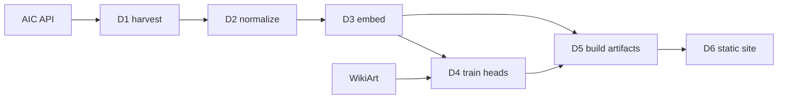

# Minerva: Build Tracker

As of 2026-09-22. Living version: https://claude.ai/code/artifact/7102f034-87f7-4100-b6e0-406c2a2b376f

## The project in one page

Minerva labels artworks by time period, location and art style, then makes that browsable on a static website. Two systems meet at a file boundary: an offline Python pipeline that produces frozen data artifacts, and a website that reads only those artifacts. The website never imports torch.

The three axes are not equally hard, and that asymmetry drives every choice below.

| Axis | Source | Model needed |
| --- | --- | --- |
| Time period | Museum metadata (`date_start` / `date_end`) | No |
| Location | Museum metadata (`place_of_origin`, free text) | No — needs normalization |
| Art style | Largely missing from museum metadata | **Yes — this is the model's job** |

So the classifier fills the one gap the data cannot. Predicted style x known date x known place is the browsing surface, and the site marks which values are observed and which are inferred.

## Decisions locked in

Two datasets with two different jobs, and a frozen backbone instead of a fine-tuned CNN.

### Corpus: Art Institute of Chicago Open Access

[AIC's public API](https://www.artic.edu/open-access/public-api) serves ~120k artworks, ~50k of them CC0 images, through an IIIF image server with no API key and a 60 req/min anonymous limit. Its metadata already carries the period and location axes. Critically, it is the only strong option whose images are legally safe to display on a public site.

Scope cap: **~9.6k painting-like works** with a public-domain image and a parseable date. Measured 2026-09-22, not estimated — AIC is overwhelmingly a works-on-paper collection, and the painting count is far smaller than first assumed:

| Type | Public domain, with image and date |
| --- | --- |
| Print | 24,613 |
| Drawing and Watercolor | 7,498 |
| **Painting** | **1,864** |
| Miniature Painting | 229 |
| *painting-like total* | *9,591* |
| *all types* | *~59,000* |

Harvested 2026-09-22: 58,787 records, of which 9,591 are painting-like — matching the API's own aggregation exactly.

Decided 2026-09-22: painting-like only. Prints are the tempting 24.6k, but AIC's prints are mostly Japanese ukiyo-e and European etchings — far outside WikiArt's domain, so the style head would be guessing on two thirds of the corpus. A smaller corpus whose labels mean something beats a large one whose labels do not.

| Dataset | Size | Style labels | Date / place | Images hostable |
| --- | --- | --- | --- | --- |
| [AIC Open Access](https://www.artic.edu/open-access/public-api) | ~50k CC0 images | `style_title`, but see below | Yes | **Yes, CC0** |
| [Met Open Access](https://github.com/metmuseum/openaccess) | ~492k objects | No | Yes | Yes, CC0 |
| [WikiArt](https://huggingface.co/datasets/huggan/wikiart) | 81,444 | **Yes, 27 styles** | Via artist only | Murky |
| [SemArt](https://github.com/noagarcia/SemArt) | 21k | School / timeframe | Excellent | No, research only |
| [Web Gallery of Art](https://www.wga.hu/database/download/index.html) | ~48k | School / form / type | Excellent | No, redistribution barred |

**AIC's `style_title` is not a style taxonomy.** Only 1,875 of 9,667 painting-like works carry one at all, and the top values are `18th Century` (260), `nineteenth century` (228), `17th Century` (185), `Chinese (culture or style)` (163), `19th century` (127) — centuries and cultures, with the same era spelled three ways. Real movements are a thin tail: Impressionism 158, Post-Impressionism 56, Realism 39. This confirms the premise the whole project rests on — the model has to supply the style axis — and rules out using AIC labels as a held-out evaluation set. Evaluate on a WikiArt split instead, and treat AIC style agreement as an eyeball check only.

### Training labels: WikiArt

Train the style head on WikiArt and never redistribute it, then apply it to the AIC corpus. That is what supplies the style dimension for images you are allowed to show.

**WikiArt is 81,444 images, 33.7 GB across 72 parquet shards** (confirmed 2026-09-23 from the repo's own `dataset_infos.json`). Do not trust HuggingFace's datasets-server for this: `/size` and `/info` report 11,320 rows because the server converts only the first ~5 GB of a repo and flags the result `"partial": true`. 5.27 of 33.7 GB converted is 11.3k of 81.4k rows, which is exactly the ratio.

### Model: frozen CLIP encoder + small trained heads

Start with `openai/clip-vit-base-patch32` to get the pipeline working end to end; swapping to ViT-L/14 or SigLIP later is a config line and a re-run of D3, because the heads are just linear layers.

Run the expensive step once, cache the vectors, and a head trains in seconds on CPU. That buys four things a fine-tuned CNN gives none of:

- **Cheap iteration** — retrain with a new taxonomy without re-encoding
- **Free extra axes** — a medium or genre head is another linear layer on the same vectors
- **Similarity navigation** — the same embeddings power "more like this" and a 2D map
- **Free text search** — CLIP's text tower means "stormy seascape" works untrained

Rejected: end-to-end ResNet-50 or ViT fine-tuning (GPU hours, one softmax, rigid), CLIP zero-shot alone (weaker, no taxonomy control), DINOv2 (great features, no text alignment).

**On the CNN baseline:** the original `Art-CNN` name implied an architecture this design does not use; the rename settled that, by way of ArtiFact and then Minerva. The baseline is still worth having — train a ResNet-50 on the same WikiArt split in D4 and report both numbers. That comparison is the most interesting paragraph in any eventual writeup — keep it as a baseline, not the product.

## Architecture

Everything the site needs is precomputed; there is no model and no backend at request time.

WikiArt enters only at D4, and only as training data — it never reaches the site.

**Images are never stored.** AIC's IIIF endpoint serves any resolution by URL straight from their CDN, so the site hotlinks thumbnails and detail images. Download images only into a local scratch cache during D3 encoding, then discard. This keeps the deploy under ~30 MB and inside the GitHub Pages free tier.

**The AIC API caps any filtered query at 1,000 results.** Asking for a deeper offset returns HTTP 403, so a filtered search cannot walk a corpus of tens of thousands. The unfiltered `/artworks` listing endpoint has no such cap and pages through all ~133k works at 100 per page. D1 therefore walks the listing and applies the corpus predicate locally — ~1,330 requests, ~25 minutes at the anonymous 60 req/min limit. It keeps every artwork type, so the painting-like decision can be revisited in D2 without another API walk.

**Ship precomputed neighbors, not raw embeddings.** 25k x 512 floats is ~50 MB in the browser; 25k rows of top-20 neighbor ids is under 5 MB. Compute the KNN once in D5.

**Stack.** Pipeline: Python 3.12 with `venv` and `pip`, `transformers`, `torch`, `polars`, `scikit-learn`, `umap-learn`. Site: Vite + React + TypeScript, static export, no server.

## Deliverables

Each one ends in something you can look at. Sizes assume evenings, not full days.

| # | Deliverable | Done when | Status |
| --- | --- | --- | --- |
| D0 | Scaffold: `pipeline/`, `web/`, `data/`, venv, `config.yaml` for backbone and corpus cap | `.venv/bin/python -m pipeline.hello` prints the config | **Done** 2026-09-22 |
| D1 | Corpus harvest: walk the AIC listing endpoint, keep public-domain works with an image and a date, cache raw JSON | `data/raw/artworks.jsonl` holds ~59k records across all types; re-running is a no-op | **Done** 2026-09-22 |
| D2 | Taxonomy + normalization: filter to painting-like, period buckets, region lookup, style label set | Coverage report prints % labeled per axis; ~9.6k works out; 50 random rows eyeballed and agreed with | **Done** 2026-09-22 |
| D3 | Embeddings: fetch at ~336px, encode with frozen CLIP, save aligned vectors | `embeddings.npy` + id list exist; 5 nearest neighbors of a Monet are other Monets | **Done** 2026-09-23 |
| D4 | Style classifier: encode WikiArt, train the head, report accuracy and per-class F1 under both a random and an artist-grouped split | Confusion matrix saved, and you can explain its worst cell | **Done** 2026-09-23 |
| D5 | Inference + index: predict style over AIC, compute top-20 KNN and 2D UMAP | `web/public/data/` holds everything the site needs, under ~10 MB | **Done** 2026-09-23 |
| D6 | Website: grid with filters, detail page, one timeline or map view | Deployed at a URL, loads in under two seconds | Not started |
| D7 | Stretch: CLIP text search, UMAP constellation, Met corpus merged, writeup | Only after D6 ships | Not started |

**D2 detail**, since it decides whether the site is browsable:

All three settled 2026-09-22, in `pipeline/taxonomy.py` (tables) and `pipeline/normalize.py` (the stage). Output: 9,132 works in `data/processed/corpus.jsonl`.

- **Period** — 50-year bins, chosen over named eras because ~10% of the corpus is Chinese, Japanese, Indian, Tibetan or Iranian and era names are Eurocentric. Spans wider than 100 years are dropped (459 works, 4.8%).

  **A work belongs to every bin its date range overlaps, not to one bin by midpoint.** Midpoint assignment turned out to be badly skewed: 910 works are dated only to a whole century, and 100% of them landed in the first half, leaving 1700-1749 at 37.6% guesswork against 1750-1799 at 4.5%. Overlap fixes it — 1600-1649 vs 1650-1699 went from 873/686 to 1,324/1,327. Every row also carries `date_precision`: exact (<=10y) 46.7%, loose (11-50y) 27.9%, vague (51-100y) 25.4%. The site must surface that, because 48.5% of works sit in more than one bin.

- **Location** — normalized to present-day countries. The tail was far shorter than feared: only **129 distinct `place_of_origin` values**, so all 129 are mapped by hand and nothing falls through by accident. Coverage is 99.8%; 15 works are genuinely unknown. Six names ambiguous between England and New England (`Bath`, `Lancaster`, `Greenwich`, `Ipswich`, `Gloucester`, `Boston`) were each checked against the records and all six are American. `Europe` and `Middle East` are kept as explicit "unspecified" values rather than folded into Unknown. Tibet is deliberately not folded into China.

- **Style** — 17 labels, mapped from WikiArt's 27 classes (verified against the HuggingFace dataset info, not recalled). Pointillism merges into Post-Impressionism; Analytical and Synthetic Cubism into Cubism. Seven postwar classes (Abstract Expressionism, Action painting, Color Field, Contemporary Realism, Minimalism, New Realism, Pop Art) are **dropped, not merged** — the corpus is public domain and therefore ~95% pre-1900, so a head that never sees Pop Art cannot predict it for an 1870 landscape.

**Watch-out for D5/D6:** `artist_title` flattens attribution — "After Raffaello Sanzio, called Raphael" becomes plain `Raphael`, putting 18th-century copies under a painter who died in 1520. `artist_display` keeps the qualifier, so the site should show that field, not `artist_title`.

**D4 results, 2026-09-23.** 73,334 WikiArt images encoded on the Spark (8,110 dropped as postwar classes), a linear head over frozen CLIP vectors with balanced class weights.

| Split | Accuracy | Macro F1 |
| --- | --- | --- |
| Random | 0.598 | 0.602 |
| **Artist-grouped, pooled over 5 folds** | **0.539** | **0.516** |

Against a 17.8% majority-class baseline on 17 classes. The gap of only -0.059 accuracy is the encouraging part: the head is learning style rather than memorising painters. Strongest classes are Ukiyo-e (0.825), Cubism (0.748) and Impressionism (0.687) — styles with a broad shared visual signature. Weakest is Fauvism (0.168, 934 works from 8 artists), a three-year movement sitting between Post-Impressionism and Expressionism.

Worst confusions are symmetric and correct: Impressionism <-> Post-Impressionism (1161/1124), Impressionism <-> Realism (985/941), Realism <-> Romanticism (707/449). Adjacent movements confusing each other in both directions is the expected behaviour, not a defect — surface confidence on the site rather than hiding it.

**"Unknown Artist" is 47% of WikiArt and must not be held out as a group.** Artist index 0 covers 34,444 of the 73,334 works. It is the absence of attribution, not a painter. Treating it as one group put half the corpus in a single test fold and depressed pooled accuracy to 0.502 for reasons unrelated to the model. Those works still train the head; the grouped metric is measured on the 38,890 attributed works only, where "an artist the model never saw" is a checkable claim.

**Evaluate per-class F1 with support alongside it.** A single grouped fold left Early Renaissance with one test example and an F1 of 0.000, which read as total failure and meant nothing. Pooling all 5 folds so every work is tested exactly once fixed it.

**D4 must split by artist, not at random.** WikiArt's 81,444 images come from 129 artists whose styles are near-fixed — every Monet is Impressionism — so a random split puts the same painter in train and test and lets the head score well by recognising painters instead of styles. D3 already showed CLIP does this readily: 18.1% of nearest neighbours share an artist. The AIC corpus is mostly painters absent from WikiArt's 129, so a random-split number would flatter the model and then disappoint in D5. Report both splits, lead with the artist-grouped one, and treat the gap between them as a result in its own right: it measures how much of the score is style versus painter recognition.

**The shards are ordered by artist, so never split by shard.** Sampling offsets 0-11,000 returns only low-index artists (Renoir, Van Gogh, Rembrandt, Monet, Aivazovsky), which is why encoding shards 0-1 yields 629 Impressionism and zero Renaissance, Rococo or Ukiyo-e. A trial on the first few shards says nothing about global class balance.

**D3 ran 2026-09-23 on a DGX Spark (GB10, sm_121, aarch64).** `scripts/d3_embed.py`, torch 2.14+cu130, batch 512: 9,101 vectors of 9,132 in under two minutes at 84.7 img/s, bounded by AIC's image server rather than the GPU. 31 images were unfetchable (0.34%), skewed Japanese (16) — large screens and scrolls whose IIIF derivative did not resolve.

Acceptance: *Poppy Field (Giverny)* returns three Monets in its top five, the other two being a Van Gogh and a Blery landscape of the same moment. Across 195 artists with 8+ works, 18.1% of top-5 neighbours share the artist against a chance rate well under 1%.

**Preprocessing backend must match across D3 and D4.** transformers 5.x falls back to `CLIPImageProcessorPil` when torchvision is absent, and PIL and torchvision resize differently, so vectors preprocessed two ways do not share a space. The fingerprint does not cover this; `manifest.json` records it. The AIC run used `CLIPImageProcessor` (torchvision), and the WikiArt run must too.

**D3 is the only compute-heavy step, and it runs elsewhere.** Write it as a self-contained, batched, resumable script that takes the D2 output and depends on nothing else in the local environment. It should run unattended in Colab or on a remote box, and `embeddings.npy` plus the id list should be the only things you copy back. Pin the backbone name and image size in `config.yaml` so the remote run and the local corpus can never drift apart.

**D5 results, 2026-09-23.** 9,101 works, bundle 4.05 MB against the 10 MB cap: `works.json` 2.82, `neighbors.json` 1.23, `facets.json` 0.01. Neighbours share a country 47.7% of the time and overlap in period 58.6%, neither of which the model was given.

**Style is withheld outside the taxonomy's domain — 385 works, 4.2%.** The 17 labels are 16 European movements plus Ukiyo-e, and Ukiyo-e is the only non-European class, so everything East Asian collapses into it: Chinese works were predicted Ukiyo-e 161 times of 193, Tibetan thangkas 12 of 19, at 0.73 mean confidence. **A confidence threshold cannot catch this**, because the head is confidently wrong rather than uncertain, so `taxonomy.STYLE_DOMAIN_COUNTRIES` declares the domain explicitly. Japan stays in: 144 of 162 predicted Ukiyo-e at 0.814, which is right. Period and country are observed facts and stay browsable for all 9,101.

Confidence is shown, never thresholded, per the decision of 2026-09-23. Western drawings predict at 0.421 against 0.576 for paintings, with 27% funnelled into Baroque — real but not disqualifying, and the reader can see it.

## D6 design: the map

Decided 2026-09-23. The site is one zoomable map of all 9,101 works, plus a detail view. You pick what the map is organised by — period, country or style — and the regions re-form around that choice.

**Two dimensions, not three.** Images are opaque, so a 3D image cloud is a pile of billboards hiding each other; a 3D *point* cloud works only because points are small enough to see past. 2D also keeps zoom-to-detail as the single navigation gesture everyone already knows, keeps region labels flat and legible instead of billboarded, and avoids depth-sorting 9,101 textured quads. The only thing 3D offers is more room to separate clusters, which a better 2D layout gives for free.

### Layout: facet chooses the region, embedding chooses the spot

The facet is a known fact and partitions the corpus. The CLIP embedding is emergent and measures visual similarity. They operate at different scales and the map uses both:

1. Each facet value gets an attractor point. Attractors are themselves placed by similarity — the mean embedding of each facet value, projected to 2D — so Baroque lands near Rococo and Impressionism near Post-Impressionism rather than in alphabetical order.
2. Each work is placed by blending its attractor with its own UMAP position, then relaxed so thumbnails do not overlap.

Regions come out fluid and organic rather than as packed circles, and boundaries are meaningful: a work sitting between Impressionism and Post-Impressionism is genuinely ambiguous, which is exactly what D4's confusion matrix says. Colour the regions with a gradient and the blend zones read as the uncertainty they are.

Switching facet re-runs step 1 and animates works to new positions. Same works, same similarity structure, different organising principle.

**Regions must use the midpoint bin, not the overlap set.** 48.4% of works belong to two period bins, and a region layout needs one home per work. `period_bin` places it; `period_bins` still drives filtering. So a work can sit in the 1700-1749 region and still match an 1750-1799 filter — deliberate, and the detail page shows both.

**Group the country tail.** 35 countries, largest 2,334, smallest 1, and 23 of them hold under 50 works (292 total). Render those as "Other Europe" / "Other Asia" rather than 23 specks. Style needs no such treatment: 18 regions, largest 2,047, only Cubism (24) and Fauvism (14) below 50.

### Thumbnail loading

The hard part is not layout, it is that 9,101 images cannot load at once. Four tiers, each earning its place:

| Tier | When | What renders | Cost |
| --- | --- | --- | --- |
| 0 | Everything visible | Dominant colour per work, one canvas | 73 KB, already in `works.json` as `k` |
| 1 | Region fills the view | 32px sprites from an atlas | ~2-3 MB total, lazy per region |
| 2 | Tens of works visible | IIIF at 200px, viewport-culled | On demand |
| 3 | Detail view | IIIF at 843px | One image |

**Tier 0 is why the colour pass exists.** The whole corpus renders instantly as a mosaic with no network at all, and the map is legible before anything loads.

**Tier 1 should be a pre-built atlas, not IIIF.** Zoom-out to zoom-in is the core interaction and it has to feel instant; 300 IIIF round-trips per pan would make it lag exactly where the site is supposed to feel good, and it would hammer a museum CDN on every pan. Atlases are built once, sharded by region so only visible regions load, and cached forever. AIC images are CC0, so a 32px atlas is legally fine — PLAN.md's "images are never stored" rule is about deploy size, and 2-3 MB is within the 10 MB budget.

Atlas maths: 9,101 tiles at 32px is 9.3M pixels, about 3 atlases of 2048x2048, roughly 1-3 MB as JPEG.

**Tiers 2 and 3 stay on IIIF**, which is what it is for — any size by URL, straight from AIC's CDN, nothing stored.

Needs one new stage, D5b, to build the atlases: re-fetch at 32px, pack in layout order, emit the sheets plus an index. It reuses the D3 fetch path and runs in about two minutes.

**The map is the landing page**, decided 2026-09-23 — provisionally, and easy to reverse, since the grid and the map read the same bundle.

**D6 minimum views**: a grid filtered on period x region x style with a confidence toggle; a detail page with the large IIIF image, all metadata, the predicted style clearly marked as predicted, and a visually-similar row from the KNN; and one of timeline or map, not both.

## D8: a bigger backbone and finer labels

Measured 2026-09-25, not assumed. 20,224 works of Artificio/WikiArt, 28 styles with at least 120 examples, artists held out of the test fold:

| Backbone | dim | Accuracy | Macro F1 | In the browser |
| --- | --- | --- | --- | --- |
| ViT-B/32 (what D3-D5 used) | 512 | 0.464 | 0.429 | 53 MB |
| ViT-B/16 | 512 | 0.484 | 0.455 | 87 MB |
| **ViT-L/14** | 768 | **0.540** | **0.520** | 173 MB |

+7.6 accuracy and +9.1 macro F1, on a harder problem than the 17-class one D4 solved: L/14 over 28 classes matches what B/32 managed over 17. The backbone was the only lever that paid.

**The head stays linear.** An MLP scored +1.3 accuracy for -0.6 macro F1 — buying the common classes with the rare ones, which is what balanced weighting exists to prevent — and took seven times as long to fit. Concatenating B/32 onto L/14 came out *below* L/14 alone, so a second backbone adds noise rather than a second opinion.

**Training data moves to [Artificio/WikiArt](https://huggingface.co/datasets/Artificio/WikiArt).** 103,250 works against huggan's 81,444, **137 style labels against 27**, in 1.7 GB against 33.7 because its images ship pre-resized to 256px. That resizing was checked before anything depended on it: the existing head, trained on full-resolution images, scores 51% top-1 and 88% top-3 on the 256px ones against 54% on its own test. No meaningful domain shift.

What the finer labels buy is coverage, not accuracy. Surrealism (4,167), Neoclassicism (2,038), Art Deco, Regionalism, Futurism, Shin-hanga and Precisionism (284) all become sayable. An O'Keeffe came back "Cubism 0.42" not because Cubism was short of data — it has 2,561 training works and the second-best F1 in the set — but because the taxonomy stopped at 1910 and softmax must answer.

The dataset also carries `date` and a 43-value `genre` field, which is a fourth map facet for free.

## Open questions

Compute and corpus scope are settled. Nothing here blocks D2.

- [x] **Compute for D3** — answered 2026-09-22: available off this machine. So D3 ships as a standalone script, not something tied to the local env.
- [x] **Corpus scope** — answered 2026-09-22: painting-like only, ~9.6k works. Prints excluded on domain-gap grounds. Reversible in D2, since D1 keeps every type.
- [ ] **Public site or local only?** If local only, WikiArt alone becomes viable as the corpus and D1 and D2 get much simpler.
- [ ] **Period buckets: 50-year bins or named eras?** Needs deciding inside D2, not before. With a ~9.6k corpus, 50-year bins may leave thin cells — check the histogram in D2 before committing.

## Risks and watch-outs

**D2 is the critical path.** D1, D3 and D5 are plumbing, D4 is well-trodden and D6 is ordinary front-end work. But if the period buckets and region mapping are sloppy, the site is unbrowsable no matter how good the classifier is. Budget real time there.

- **Adjacent movements will confuse the classifier.** Impressionism against Post-Impressionism is genuinely ambiguous. That is correct behavior, not a bug — surface confidence on the site rather than hiding it.
- **Domain gap.** Settled by scoping to painting-like types, at the cost of corpus size. Watch it again if prints are ever added: 7,498 of the 9,591 kept works are drawings and watercolours, which are already a step from WikiArt's oil-on-canvas centre of mass.
- **AIC style coverage disappointed, as expected — see above.** It is centuries and cultures, not movements, and 19% coverage. The Met CSV remains the drop-in second source if ~9.6k proves too thin to browse; build the D2 schema to accept both from day one.
- **Scope creep at D7.** Nothing in the stretch list starts before D6 is deployed.
- **Licenses.** AIC images are CC0 and safe to display. WikiArt, SemArt and the Web Gallery of Art are training-time only — never redistribute their images.

## Sources

- [Art Institute of Chicago — Open Access and public API](https://www.artic.edu/open-access/public-api), [API docs](http://api.artic.edu/docs/)
- [The Met — Open Access dataset](https://github.com/metmuseum/openaccess)
- [WikiArt on Hugging Face](https://huggingface.co/datasets/huggan/wikiart)
- [SemArt](https://github.com/noagarcia/SemArt)
- [Web Gallery of Art — database download](https://www.wga.hu/database/download/index.html)
- [Curated list of art datasets](https://github.com/georgeblck/art-datasets)
